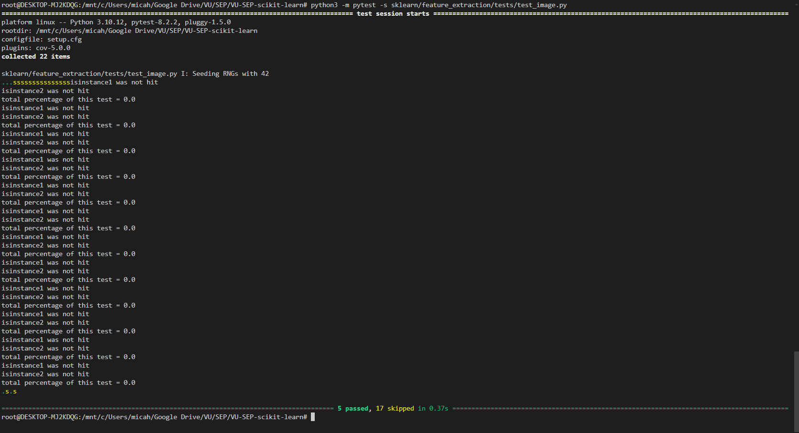
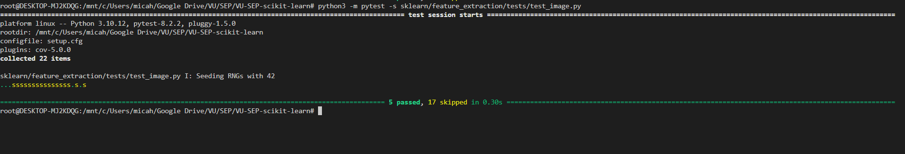
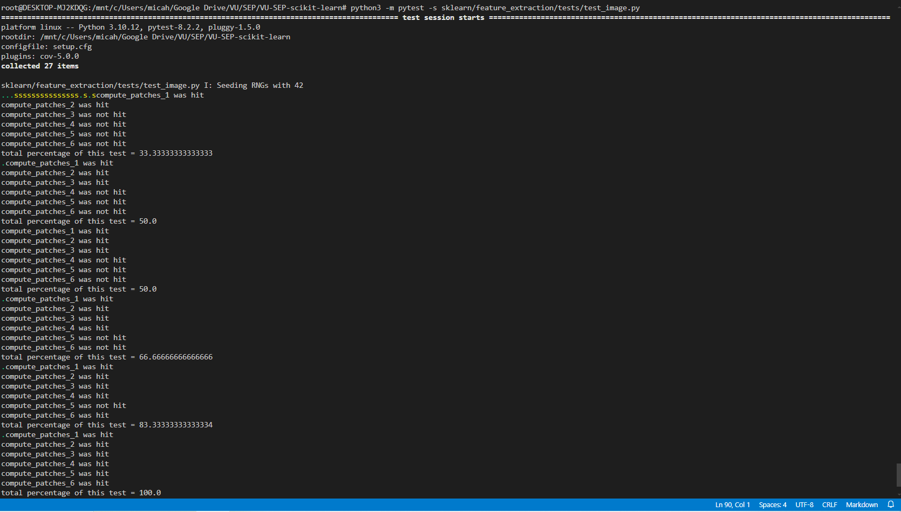
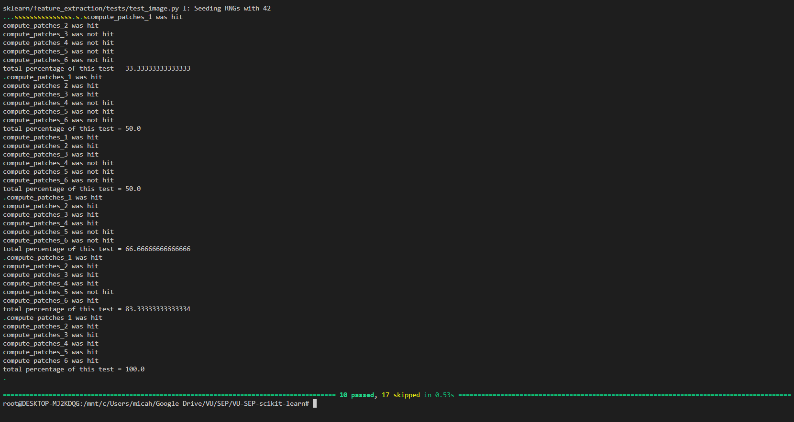
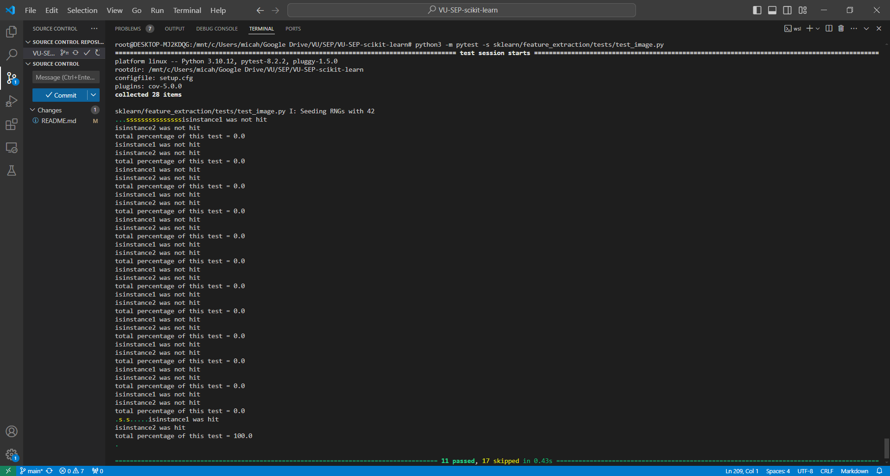

# Report for Assignment 1

## Project chosen

Name: scikit-learn

URL: https://github.com/scikit-learn/scikit-learn

Number of lines of code and the tool used to count it: 268.052

Programming language: Python(92,4%), Cython(5,6%), C++(1,1%), Meson(0,2%), Shell(0,3%), C(0,1%)

## Coverage measurement

For measuring the coverage and testing later, we chose to set a SEED for the random generator, so that the coverage would not be different everytime we run the tests. By setting the seed we could work and improve branch coverages.

### Existing tool

<Inform the name of the existing tool that was executed and how it was executed>
Python, coverage.py (pytest)

<Show the coverage results provided by the existing tool with a screenshot>

### Your own coverage tool

<The following is supposed to be repeated for each group member>

<Team member 1: Stefanos Poullos>

<Function 1 name : def _fetch_brute_kddcup99>

<Show a patch (diff) or a link to a commit made in your forked repository that shows the instrumented code to gather coverage measurements
if available:
(https://github.com/MicahVU/VU-SEP-scikit-learn/commit/c783cbcf466b43095be9945aa2496a4387b6042e#diff-6020384f05da59b3ef5b9078a33ceca19b61f65b7b18806c9b91587fd22594e0)>

<Provide a screenshot of the coverage results output by the instrumentation
 (https://github.com/MicahVU/VU-SEP-scikit-learn/blob/main/coverage_of_functions_before_instrumentation.jpg) >

<Function 2 name : _fetch_kddcup99>

<Provide the same kind of information provided for Function 1

these are the same links as above since both functions were done in the same commit

(https://github.com/MicahVU/VU-SEP-scikit-learn/commit/c783cbcf466b43095be9945aa2496a4387b6042e#diff-6020384f05da59b3ef5b9078a33ceca19b61f65b7b18806c9b91587fd22594e0)

(https://github.com/MicahVU/VU-SEP-scikit-learn/blob/main/coverage_of_functions_before_instrumentation.jpg)
>

<Team member 2: Yevgeniy Stadnyk>

<Function 1 strip_newsgroup_footer>

<Show a patch (diff) or a link to a commit made in your forked repository that shows the instrumented code to gather coverage measurements>
https://github.com/MicahVU/VU-SEP-scikit-learn/commit/a4e6e3b10caf0ee987c6b8681f92917b9dc93200
==>in the datasets file i have the print coverage function and a few branch_coverage functions calculating for their respective functions, but I commented them out.
<Provide a screenshot of the coverage results output by the instrumentation>
https://github.com/MicahVU/VU-SEP-scikit-learn/commit/91106865e5c8d4682f7061341d98abfa5ccd0d04
<Function 2 fetch_20newsgroups>

<Provide the same kind of information provided for Function 1>
<Show a patch (diff) or a link to a commit made in your forked repository that shows the instrumented code to gather coverage measurements>
The link is the same since I did the improvement of the tests and just the branch coverage in one big commit.
<Provide a screenshot of the coverage results output by the instrumentation>
https://github.com/MicahVU/VU-SEP-scikit-learn/commit/1557c5e7e4b92293ea99c3fad231d9609d4cea1d

<Team member 3: Mikolaj Magiera>

<Function 1 name>
def fit(self, X, y, sample_weight=None) [in _quantile.py]

<Show a patch (diff) or a link to a commit made in your forked repository that shows the instrumented code to gather coverage measurements>
https://github.com/MicahVU/VU-SEP-scikit-learn/commit/d7808859e292fd478ff90eab0a80b41925d21dc0

<Provide a screenshot of the coverage results output by the instrumentation>

<Function 2 name>
def fit(self, X, y=None, sample_weight=None) [in _polynomial.py]

<Provide the same kind of information provided for Function 1>
<Link to commit made in forked repository that shows the instrumented code to gather coverage measurements>
https://github.com/MicahVU/VU-SEP-scikit-learn/commit/d64512c0831ed41b495706469d71045eaf14abc8

<Provide a screenshot of the coverage results output by the instrumentation>

<Team member 4: Micah Rouwendaal>

<Function 1 name>
def _extract_patches(arr, patch_shape=8, extraction_step=1)

<Show a patch (diff) or a link to a commit made in your forked repository that shows the instrumented code to gather coverage measurements>
https://github.com/MicahVU/VU-SEP-scikit-learn/commit/fc9299bc946944e9a6b505bad1cfa899ec25be24

<Provide a screenshot of the coverage results output by the instrumentation>

<Function 2 name>
def _compute_n_patches(i_h, i_w, p_h, p_w, max_patches=None)

<Provide the same kind of information provided for Function 1>
<Link to commit made in forked repository that shows the instrumented code to gather coverage measurements>
https://github.com/MicahVU/VU-SEP-scikit-learn/commit/0853288f57f631c83d082cbe57c952b0c63238aa

<Provide a screenshot of the coverage results output by the instrumentation>

<Important: I commented out the branch_coverage flags of the other function in the second part, since otherwise these would also be counted as flags and thus resulting in a different branch coverage percentage.>

## Coverage improvement

### Individual tests
Some tests are done on functions that are not called. This is due to a weird flag not set probably, resulting in branch coverage 0%. We tried to figure this out, but could not fix it, so we made our own test cases resulting in a big improvement of branch coverage. Other tests would run succesfully, and in this case we improved the branch coverage by adding or enhancing existing tests.

<The following is supposed to be repeated for each group member>

<Team member 1: Stefanos Poullos>

<Test 1>

<Show a patch (diff) or a link to a commit made in your forked repository that shows the new/enhanced test

(https://github.com/MicahVU/VU-SEP-scikit-learn/commit/c783cbcf466b43095be9945aa2496a4387b6042e#diff-d75de98f144d7a70bd99b7359f0fa9420a0229ba6800d1d7624d5e2e2209babe)

<Provide a screenshot of the old coverage results (the same as you already showed above)>
(https://github.com/MicahVU/VU-SEP-scikit-learn/blob/main/coverage_of_functions_before_instrumentation.jpg)

<Provide a screenshot of the new coverage results>
(https://github.com/MicahVU/VU-SEP-scikit-learn/blob/main/coverage_of_functions_after_instrumentation.jpg)
(https://github.com/MicahVU/VU-SEP-scikit-learn/blob/main/coverage_of_test_file_after.jpg)

<State the coverage improvement with a number and elaborate on why the coverage is improved
(number is in the second explanation)

==> The coverage has improved because now we cover the case where dataset is not available locally by setting the flag to false in the patch
>

<Test 2>

<Provide the same kind of information provided for Test 1
The  links are exactly the same because the tests have been improved in the same commit
>
<State the coverage improvement with a number and elaborate on why the coverage is improved

==> The coverage has improved (26% -> 98%) because by mocking the data we ensure that all code paths are tested, since some code paths are rarely executed in normal usage and in this case the network calls prevent that
>
<Team member 2: Yevgeniy Stadnyk>

<Test 1>

<Show a patch (diff) or a link to a commit made in your forked repository that shows the new/enhanced test>
https://github.com/MicahVU/VU-SEP-scikit-learn/commit/a4e6e3b10caf0ee987c6b8681f92917b9dc93200

<Provide a screenshot of the old coverage results (the same as you already showed above)>
https://github.com/MicahVU/VU-SEP-scikit-learn/commit/91106865e5c8d4682f7061341d98abfa5ccd0d04

<Provide a screenshot of the new coverage results>
https://github.com/MicahVU/VU-SEP-scikit-learn/commit/6b88943dcf073a01203bb9832e4ea4e745f34cad
<State the coverage improvement with a number and elaborate on why the coverage is improved>
==> The coverage has improved (0% -> 100%) because in the original test file the function was not even called, therefore not tested. After retrieving the function and trying to find different inputs to check for the different branches. it was managed to get all 3 branches to be hit.
<Test 2>

<Provide the same kind of information provided for Test 1>
==>The link for the commit made in the forked repository for the new/enhanced test is the same as for test 1 since it was done in the same commit.

<Provide a screenshot of the old coverage results (the same as you already showed above)>
https://github.com/MicahVU/VU-SEP-scikit-learn/commit/1557c5e7e4b92293ea99c3fad231d9609d4cea1d

<Provide a screenshot of the new coverage results>
https://github.com/MicahVU/VU-SEP-scikit-learn/commit/a6bd4f57d47f484b7c699f960ec932a4361c9efd

==> The coverage has improved (0% -> 85.7%) because in the original test file there was a test created for the function fetch_20newsgroups, however
it lacked data, it heavily got increased by patch decorators in unit tests. Like for example using side-effects to check for cache misses and other instances which allowed the test cases to hit more branches.

<Team member 3: Mikolaj Magiera>

<Test 1>

<Show a patch (diff) or a link to a commit made in your forked repository that shows the new/enhanced test>
https://github.com/MicahVU/VU-SEP-scikit-learn/commit/45b6cc9d3af7e981f458b5f0600eba8db305112a

<Provide a screenshot of the old coverage results (the same as you already showed above)>

<Provide a screenshot of the new coverage results>

<State the coverage improvement with a number and elaborate on why the coverage is improved>
The coverage is improved from 50% to 83.33%, thus it clearly is an improvement. Most of the branches which were not reached before are now covered.

<Test 2>

<Provide the same kind of information provided for Test 1>
<Show a patch (diff) or a link to a commit made in your forked repository that shows the new/enhanced test>
https://github.com/MicahVU/VU-SEP-scikit-learn/commit/94008110d4cb0ecb9a19d3be1e885f0ff13d4d1b

<Provide a screenshot of the old coverage results (the same as you already showed above)>

<Provide a screenshot of the new coverage results>

<State the coverage improvement with a number and elaborate on why the coverage is improved>
The coverage is improved from 76.92% to 92.31%, thus it clearly is an improvement. Most of the branches which were not reached before are now covered.

<Team member 4: Micah Rouwendaal>

<Test 1>

<Show a patch (diff) or a link to a commit made in your forked repository that shows the new/enhanced test>
https://github.com/MicahVU/VU-SEP-scikit-learn/commit/dd2976c00c728bdb80f7de9759b85214a324a7dd

<Provide a screenshot of the old coverage results (the same as you already showed above)>

<Provide a screenshot of the new coverage results>

The last picture might be redundant, but I added it for clearity.

<State the coverage improvement with a number and elaborate on why the coverage is improved>
The branch coverage went up from 0% -> 100%. Initially it did not have any coverage, since the test was not fired by an unknown reason. We have tried to figure out why this is, but it probably has to do with some flag that is not set(maybe this is because we set a seed to the randomness in the conftest.py). However, I read what the functions would do, what args it takes, and with all of that created different tests, so that the branch coverage could be improved to 100%.

<Test 2>

<Provide the same kind of information provided for Test 1>

<Show a patch (diff) or a link to a commit made in your forked repository that shows the new/enhanced test>>
https://github.com/MicahVU/VU-SEP-scikit-learn/commit/c2bccda24e07074e104458075c1358f3ae06a5e1

<Provide a screenshot of the old coverage results (the same as you already showed above)>

<Provide a screenshot of the new coverage results>

<State the coverage improvement with a number and elaborate on why the coverage is improved>
The branch coverage went up from 0% -> 100%. Initially the function is called by other functions like extract_patches_2d, however the is_instance if branches never got hit. I added a test that makes the patches_shape and the extraction_step both integers, so that both the if statements will be hit and therefore resulting in a branch coverage of 100%.
For this function I needed to figure out what the if branches meant and what the input parameters meant, after this I could easily add a test so that both if statements would be satisfied.

### Overall

<Provide a screenshot of the old coverage results by running an existing tool (the same as you already showed above)>

<Provide a screenshot of the new coverage results by running the existing tool using all test modifications made by the group>

## Statement of individual contributions

<Write what each group member did>
Micah Rouwendaal, studentnumber: 2741567
Created the repository, started the project off. Looked for functions to improve, found some for himself and the team. Measured the branch coverage of everything with an existing tool, but also measured the branch coverage of 2 functions(extract_patches and _compute_n_patches in image.py) and improved the branch coverage of those functions.

Yevgeniy Stadnyk, studentnumber: 2727171
Finding out how to configure the branch coverage fwith the existing tool. Finding functions to improve. Measured branch coverage with own tool, for 2 functions strip_newsgroup_footer and fetch_20newsgroups. Improved the branch coverage of these functions.

Stefanos Poullos, studentnumber: 2756510
Measured the branch coverage of everything with an existing tool, measure coverage of functions that I worked on with my own tool and improved those functions
